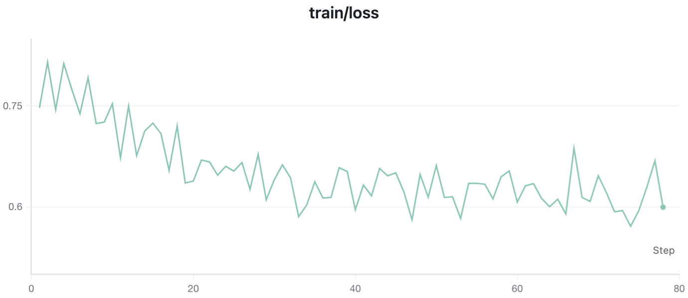

# Bradley-Terry Training

Train judge models using Bradley-Terry loss on preference pairs. This approach learns to rank responses by modeling the probability that one response is preferred over another.

## Overview

Bradley-Terry training is the **simplest and most widely used** method for judge model training. It works with binary preference data (chosen vs. rejected) and optimizes the model to predict which response humans prefer.

> **Tip:** Use Bradley-Terry when you have preference pairs (e.g., from RLHF annotation), binary comparison data, or need a model that outputs scalar scores.

**Training objective:**

The model learns to maximize:

$$\mathcal{L} = -\log \sigma(r_{\text{chosen}} - r_{\text{rejected}})$$

Where $r$ is the score and $\sigma$ is the sigmoid function.


## Quick Start

```bash
# 1. Install dependencies
pip install verl==0.6.1

# 2. Run training
cd cookbooks/training_judge_model/bradley-terry
bash run_bt_rm.sh
```


## Dataset

We provide pre-processed datasets on HuggingFace:

| Dataset | Description | Link |
|---------|-------------|------|
| `agentscope-ai/OpenJudge` | HelpSteer2 preference pairs for BT training | [🔗 HuggingFace](https://huggingface.co/datasets/agentscope-ai/OpenJudge/tree/main/train_rm/bradley_terry) |

**Source:** [nvidia/HelpSteer2](https://huggingface.co/datasets/nvidia/HelpSteer2) preference subset.

**Processing:**
- Input: HelpSteer2 preference JSONL with `preference_strength` field (range: -3 to 3)
- Filter: `|preference_strength| >= 1` (keep pairs with clear preference)
- Positive strength → `response_2` is chosen; Negative → `response_1` is chosen
- Convert to chat messages format for Instruct models


## Data Format

Bradley-Terry training expects Parquet files with two columns:

| Column | Type | Description |
|--------|------|-------------|
| `chosen` | string | JSON string of messages list (preferred response) |
| `rejected` | string | JSON string of messages list (rejected response) |

**Example data structure:**

```python
import json
import pandas as pd

# Messages format (compatible with tokenizer.apply_chat_template)
chosen = json.dumps([
    {"role": "user", "content": "What are the benefits of exercise?"},
    {"role": "assistant", "content": "Regular exercise improves cardiovascular health, boosts mood, and increases energy levels."}
])
rejected = json.dumps([
    {"role": "user", "content": "What are the benefits of exercise?"},
    {"role": "assistant", "content": "Exercise is good for you."}
])

df = pd.DataFrame({"chosen": [chosen], "rejected": [rejected]})
df.to_parquet("train.parquet")
```

> **Note:** Multi-turn conversations are supported. Include all turns in the messages list.


## Configuration

### Training Script (`run_bt_rm.sh`)

Key parameters to customize:

| Parameter | Description | Default |
|-----------|-------------|---------|
| `MODEL_PATH` | Base model for initialization | `qwen3-32b` |
| `TRAIN_FILE` | Training data path | Parquet file |
| `VAL_FILE` | Validation data path | Parquet file |
| `TRAIN_BATCH_SIZE` | Global batch size | 256 |
| `MICRO_BATCH_SIZE` | Per-GPU micro batch | 1 |
| `LR` | Learning rate | 5e-7 |
| `TOTAL_EPOCHS` | Training epochs | 3 |

### Hydra Config (`trainer.yaml`)

**Data:**

```yaml
data:
  train_batch_size: 256        # Global batch size (distributed across GPUs)
  micro_batch_size_per_gpu: 1  # Per-GPU micro batch size
  max_length: 4096             # Maximum sequence length
  truncation: left             # Truncation: left/right/error
```

**Model:**

```yaml
model:
  partial_pretrain: qwen3-32b              # Base model path
  strategy: fsdp2                          # fsdp or fsdp2
  enable_gradient_checkpointing: true      # Save memory
```

**Optimizer:**

```yaml
optim:
  lr: 5e-7                     # Learning rate
  weight_decay: 0.001          # Weight decay
  warmup_steps_ratio: 0.03     # Warmup steps ratio
  clip_grad: 2.0               # Gradient clipping
  lr_scheduler: cosine         # Scheduler: cosine/wsd/constant
```


## Monitoring Training

### Metrics

| Metric | Description |
|--------|-------------|
| `train/loss` | Bradley-Terry loss |
| `train/accuracy` | Preference prediction accuracy (chosen > rejected) |
| `train/lr(1e-3)` | Current learning rate (×1e3) |
| `val/loss` | Validation loss |
| `val/accuracy` | Validation accuracy |

### Train/Loss Curve




## Troubleshooting

### OOM (Out of Memory)

- Reduce `micro_batch_size_per_gpu`
- Enable `enable_gradient_checkpointing`
- Reduce `max_length`
- Use `fsdp2` strategy

### Unstable Training / Loss Explosion

- Lower learning rate
- Increase `clip_grad` value
- Check data quality

### Accuracy Not Improving

- Verify data labeling quality
- Check chosen/rejected mapping
- Increase learning rate
- Train more epochs


## Next Steps

- [SFT for Judge Models](../sft/README.md) — Pre-train with supervised fine-tuning
