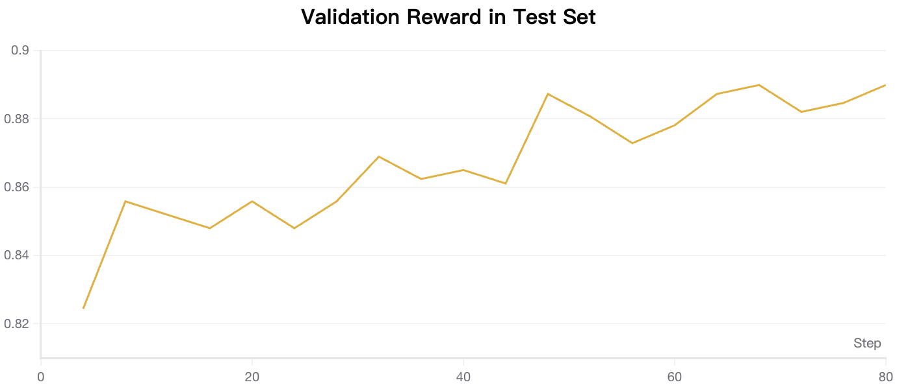
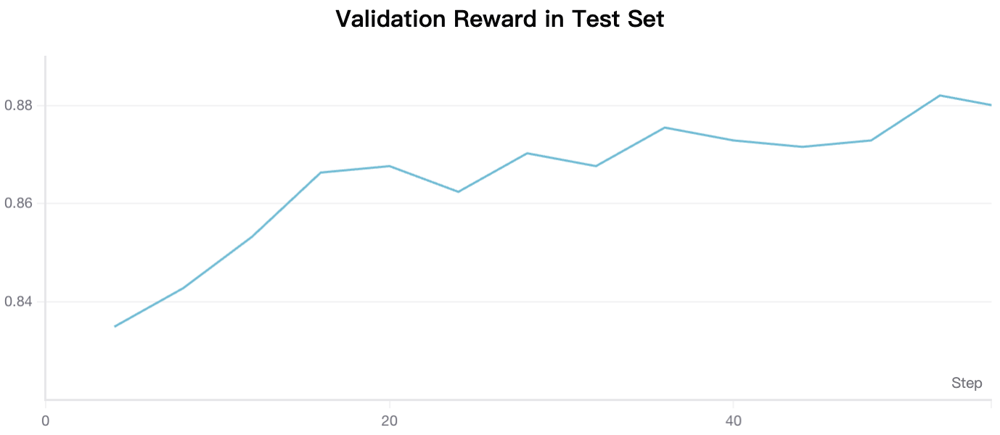

# GRPO Training (Reinforcement Learning)

Train judge models using Group Relative Policy Optimization (GRPO) reinforcement learning. This approach learns to generate evaluation outputs by optimizing against rule-based reward signals, without requiring a separate critic model.

## Overview

GRPO training is a **powerful method for training generative judge models**. Unlike Bradley-Terry which outputs scalar scores, GRPO trains models to generate structured evaluation outputs with reasoning (thinking) and final judgments.

> **Tip:** Use GRPO when you need interpretable evaluations with explanations, want to leverage the model's reasoning capabilities, or require flexible output formats (scores or comparisons).

**Training objective:**

GRPO optimizes the policy using group-relative advantages:

$$\mathcal{L} = -\mathbb{E}\left[\sum_{i=1}^{G} A_i \log \pi_\theta(y_i|x)\right]$$

Where $A_i$ is the advantage computed relative to other samples in the same group, and $G$ is the group size.

**Two Training Modes:**

| Mode | Task | Output Format | Use Case |
|------|------|---------------|----------|
| **Pointwise** | Rate single response quality | `<think>...</think><score>0-4</score>` | Absolute quality scoring |
| **Pairwise** | Compare two responses | `<think>...</think><better>A or B</better>` | Preference comparison |


## Prerequisites

### Software Requirements

```bash
pip install verl==0.6.1
```

### Ray Cluster Setup

GRPO training requires a Ray cluster. Set up based on your environment:

**Single Node (8 GPUs):**

```bash
# Start Ray head node
ray start --head --port=6379 --dashboard-port=8265

# Verify cluster
ray status
```

**Multi-Node Cluster:**

```bash
# On head node
ray start --head --port=6379 --dashboard-port=8265

# On worker nodes
ray start --address="<head-node-ip>:6379"
```

> **Note:** Ensure `RAY_ADDRESS` environment variable is set to `http://<head-node-ip>:8265` before training.


## Quick Start

### Pointwise Mode

```bash
# 1. Set up Ray cluster (if not already running)
ray start --head --port=6379 --dashboard-port=8265

# 2. Run training
cd cookbooks/training_judge_model/grpo
bash pointwise/run_pointwise.sh
```

### Pairwise Mode

```bash
# 1. Set up Ray cluster (if not already running)
ray start --head --port=6379 --dashboard-port=8265

# 2. Run training
cd cookbooks/training_judge_model/grpo
bash pairwise/run_pairwise.sh
```


## Dataset

We provide pre-processed datasets on HuggingFace:

| Dataset | Description | Link |
|---------|-------------|------|
| `agentscope-ai/OpenJudge` | RewardBench2 for GRPO Pointwise | [🔗 HuggingFace](https://huggingface.co/datasets/agentscope-ai/OpenJudge/tree/main/train_rm/grpo/pointwise) |
| `agentscope-ai/OpenJudge` | RewardBench2 for GRPO Pairwise | [🔗 HuggingFace](https://huggingface.co/datasets/agentscope-ai/OpenJudge/tree/main/train_rm/grpo/pairwise) |

**Source:** [RewardBench-2](https://huggingface.co/datasets/allenai/reward-bench) dataset.

**Processing:**
- Filter out tie samples (keep clear preferences for pairwise)
- Convert to unified input/output format with labels
- Split into train/validation sets


## Data Format

### Pointwise Format

Parquet files with the following structure:

| Column | Type | Description |
|--------|------|-------------|
| `input` | list | List of message dicts `[{"role": "user", "content": "..."}]` |
| `output` | list | Response with label `[{"answer": {"role": "assistant", "content": "...", "label": {"helpfulness": 0-4}}}]` |
| `source` | string | Data source identifier |

**Example:**

```python
{
    "input": [{"role": "user", "content": "What is machine learning?"}],
    "output": [{
        "answer": {
            "role": "assistant",
            "content": "Machine learning is a branch of AI...",
            "label": {"helpfulness": 4}
        }
    }],
    "source": "rewardbench2"
}
```

### Pairwise Format

Similar structure but with two responses in output:

```python
{
    "input": [{"role": "user", "content": "Explain quantum computing"}],
    "output": [
        {"answer": {"role": "assistant", "content": "Response A...", "label": {"preference": "A"}}},
        {"answer": {"role": "assistant", "content": "Response B...", "label": {"preference": "A"}}}
    ],
    "source": "rewardbench2"
}
```


## Pointwise Mode

### Task Description

The model evaluates a single response and outputs a helpfulness score from 0 to 4.

**Input Template:**

```
# Task Description
You are a professional expert in response quality evaluation...

# Principles
1. Helpfulness: How well does the response address the user's needs (0=not helpful, 4=extremely helpful)
2. Accuracy: Factual correctness and reliability of information
...

# Query
{user_question}

# Response
{assistant_response}

# Output Format
<think>Analysis process based on principles</think><score>helpfulness score from 0 to 4</score>
```

**Expected Output:**

```
<think>Let me analyze this response...
1. Helpfulness: The response directly addresses the question with clear steps...
2. Accuracy: The information provided is factually correct...
</think>
<score>4</score>
```

### Reward Function

The reward is computed by comparing predicted score with ground truth:

- **When true label is 0 or 1:** Exact match required
  - Correct: Reward = 1.0
  - Wrong: Reward = 0.0
- **When true label is 2, 3, or 4:** Proportional reward based on difference
  - Reward = 1.0 - |predicted - true| / 4
  - Example: predicted=3, true=4 → Reward = 0.75


## Pairwise Mode

### Task Description

The model compares two responses and determines which one is better.

**Input Template:**

```
# Task Description
You are a professional expert in response comparison...

# Principles
1. Helpfulness: How well does the response address the user's needs
2. Accuracy: Factual correctness and reliability of information
3. Safety: Avoiding harmful or inappropriate content

# Query
{user_question}

# Response A
{response_a}

# Response B
{response_b}

# Output Format
<think>Analysis process based on principles</think><better>A or B</better>
```

**Expected Output:**

```
<think>Comparing both responses...
- Response A provides more detailed explanations...
- Response B is accurate but less comprehensive...
Based on the principles, Response A better addresses the user's needs.
</think>
<better>A</better>
```

### Reward Function

The reward is computed by comparing predicted preference with ground truth:

- **Correct prediction (A==A or B==B):** Reward = 1.0
- **Wrong prediction:** Reward = 0.0
- **Failed to extract preference:** Reward = 0.0


## Configuration

### Training Script Parameters

Both `run_pointwise.sh` and `run_pairwise.sh` support environment variable overrides:

| Parameter | Description | Default |
|-----------|-------------|---------|
| `RAY_ADDRESS` | Ray cluster dashboard address | `http://127.0.0.1:8265` |
| `MODEL_PATH` | Base model (HF ID or local path) | `Qwen/Qwen3-8B` |
| `TRAIN_FILE` | Training data path | `./data/*.parquet` |
| `VAL_FILE` | Validation data path | `./data/*.parquet` |
| `SAVE_PATH` | Checkpoint output directory | `./checkpoints/grpo/*` |
| `N_GPUS_PER_NODE` | GPUs per node | `8` |
| `N_NODES` | Number of nodes | `1` |

**Example with custom settings:**

```bash
MODEL_PATH=Qwen/Qwen3-32B \
N_GPUS_PER_NODE=8 \
TRAIN_BATCH_SIZE=48 \
bash pointwise/run_pointwise.sh
```

### Key Hyperparameters

| Parameter | Pointwise | Pairwise | Description |
|-----------|-----------|----------|-------------|
| `TRAIN_BATCH_SIZE` | 96 | 96 | Global batch size |
| `LR` | 1e-6 | 1e-6 | Learning rate |
| `KL_LOSS_COEF` | 0.001 | 0.001 | KL divergence coefficient |
| `ROLLOUT_N` | 4 | 4 | Samples per prompt |
| `TOTAL_EPOCHS` | 1 | 30 | Training epochs |

### Runtime Environment (`runtime_env.yaml`)

```yaml
working_dir: ./
excludes: ["/.git/"]
env_vars:
  TORCH_NCCL_AVOID_RECORD_STREAMS: "1"
  CUDA_DEVICE_MAX_CONNECTIONS: "1"
  SWANLAB_API_KEY: "${SWANLAB_API_KEY}"  # Set your API key
```

> **Note:** Set `SWANLAB_API_KEY` environment variable for experiment tracking, or change logger to `['console']` only.


## Ray Cluster Configuration

### Single Machine (Recommended for Testing)

```bash
# Start Ray with all resources
ray start --head --port=6379 --dashboard-port=8265

# Check status
ray status

# View dashboard at http://localhost:8265
```

### Multi-Node Setup

**Head Node:**

```bash
ray start --head \
    --port=6379 \
    --dashboard-port=8265 \
    --num-gpus=8
```

**Worker Nodes:**

```bash
ray start \
    --address="<head-ip>:6379" \
    --num-gpus=8
```

**Training Script:**

```bash
export RAY_ADDRESS="http://<head-ip>:8265"
export N_NODES=2
bash pointwise/run_pointwise.sh
```

### Resource Requirements

| Configuration | GPUs | Memory per GPU | Recommended Model Size |
|---------------|------|----------------|------------------------|
| Minimum | 8 | 40GB | 8B parameters |
| Recommended | 8 | 80GB | 8B-32B parameters |
| Large Scale | 16+ | 80GB | 32B+ parameters |


## Monitoring Training

### Metrics

| Metric | Description |
|--------|-------------|
| `train/reward_mean` | Average reward across samples |
| `train/reward_std` | Reward standard deviation |
| `train/kl_divergence` | KL divergence from reference model |
| `train/policy_loss` | Policy gradient loss |
| `val/reward_mean` | Validation reward |

### Training Curves

**Pointwise Training:**



**Pairwise Training:**



Higher reward indicates better alignment with ground truth labels.


## Troubleshooting

### Ray Connection Issues

```
Error: Could not connect to Ray cluster
```

**Solutions:**
- Verify Ray is running: `ray status`
- Check `RAY_ADDRESS` is correct
- Ensure firewall allows port 6379 and 8265

### OOM (Out of Memory)

**Solutions:**
- Reduce `TRAIN_BATCH_SIZE`
- Enable `param_offload=True` in actor config
- Reduce `MAX_PROMPT_LENGTH` or `MAX_RESPONSE_LENGTH`
- Use `gpu_memory_utilization=0.5` for vLLM

### Reward Not Improving

**Solutions:**
- Check data format matches expected schema
- Verify reward function extracts scores correctly
- Lower learning rate
- Increase `ROLLOUT_N` for more diverse samples

### vLLM Memory Issues

```
Error: CUDA out of memory during rollout
```

**Solutions:**
- Set `PYTORCH_CUDA_ALLOC_CONF=expandable_segments:False`
- Reduce `gpu_memory_utilization`
- Reduce `tensor_model_parallel_size`


## Next Steps

- [SFT Training](../sft/README.md) — Pre-train with supervised fine-tuning
- [Bradley-Terry Training](../bradley-terry/README.md) — Train with preference pairs

