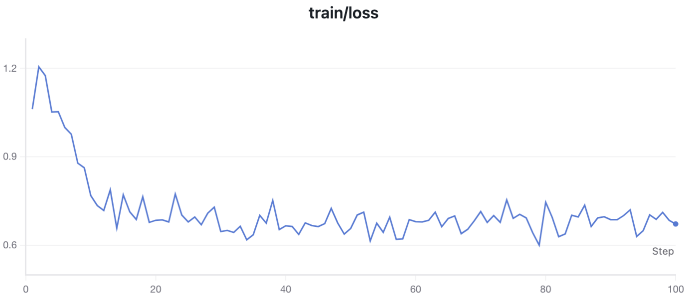

# SFT Training

Train judge models using Supervised Fine-Tuning (SFT) on high-quality conversation data. This approach learns to generate responses that match expert demonstrations.

## Overview

SFT training is the **foundation for building judge models**. It works with conversation data (messages format) and optimizes the model to generate responses similar to high-quality examples.

> **Tip:** Use SFT when you want to initialize a model before preference training, have high-quality demonstration data, or need a generative judge that outputs explanations.

**Training objective:**

The model learns to minimize cross-entropy loss:

$$\mathcal{L} = -\sum_{t} \log P(y_t | y_{<t}, x)$$

Where $x$ is the input and $y$ is the target response.


## Quick Start

```bash
# 1. Install dependencies
pip install verl==0.6.1

# 2. Run training
cd cookbooks/training_judge_model/sft
bash run_sft_rm.sh
```


## Dataset

We provide pre-processed datasets on HuggingFace:

| Dataset | Description | Link |
|---------|-------------|------|
| `agentscope-ai/OpenJudge` | HelpSteer2 high-quality responses for SFT | [🔗 HuggingFace](https://huggingface.co/datasets/agentscope-ai/OpenJudge/tree/main/train_rm/sft) |

**Source:** [nvidia/HelpSteer2](https://huggingface.co/datasets/nvidia/HelpSteer2) main dataset.

**Processing:**
- Input: HelpSteer2 with quality scores (`correctness`, `helpfulness`, `coherence`, `complexity`, `verbosity`, each 0-4)
- Filter: `correctness >= 4` (keep only high-quality, factually correct responses)
- Convert to chat messages format `[{"role": "user", ...}, {"role": "assistant", ...}]`


## Data Format

SFT training expects Parquet files with a `messages` column:

| Column | Type | Description |
|--------|------|-------------|
| `messages` | list | List of message dicts with role and content |

**Example data structure:**

```python
import pandas as pd

# Messages format (compatible with tokenizer.apply_chat_template)
messages = [
    {"role": "user", "content": "What are the benefits of exercise?"},
    {"role": "assistant", "content": "Regular exercise improves cardiovascular health, boosts mood, and increases energy levels."}
]

df = pd.DataFrame({"messages": [messages]})
df.to_parquet("train.parquet")
```

> **Note:** Multi-turn conversations are supported. Include all turns in the messages list.


## Configuration

### Training Script (`run_sft_rm.sh`)

Key parameters to customize:

| Parameter | Description | Default |
|-----------|-------------|---------|
| `MODEL_PATH` | Base model for initialization | `qwen3-32b` |
| `TRAIN_FILE` | Training data path | Parquet file |
| `VAL_FILE` | Validation data path | Parquet file |
| `TOTAL_BATCH_SIZE` | Global batch size | 96 |
| `MICRO_BATCH_SIZE` | Per-GPU micro batch | 12 |
| `SP_SIZE` | Sequence parallel size | 8 |
| `TOTAL_EPOCHS` | Training epochs | 1 |

### Key Config Options

**Data:**

```yaml
data:
  train_batch_size: 96           # Global batch size
  micro_batch_size: 12           # Per-GPU micro batch
  max_length: 4096               # Maximum sequence length
  truncation: right              # Truncation direction
  multiturn:
    enable: true                 # Enable multi-turn format
    messages_key: messages       # Column name for messages
```

**Model:**

```yaml
model:
  partial_pretrain: qwen3-32b              # Base model path
  enable_gradient_checkpointing: true      # Save memory
  fsdp_config:
    cpu_offload: false
    model_dtype: bf16
```

**Sequence Parallel:**

```yaml
ulysses_sequence_parallel_size: 8    # Sequence parallel size
use_remove_padding: true             # Remove padding for efficiency
```


## Monitoring Training

### Metrics

| Metric | Description |
|--------|-------------|
| `train/loss` | Cross-entropy loss |
| `train/lr` | Current learning rate |
| `val/loss` | Validation loss |

### Train/Loss Curve



Lower loss indicates the model better matches the target responses.


## Troubleshooting

### OOM (Out of Memory)

- Reduce `MICRO_BATCH_SIZE`
- Enable `enable_gradient_checkpointing`
- Reduce `max_length`
- Enable `cpu_offload`

### Unstable Training / Loss Explosion

- Lower learning rate
- Check data quality
- Ensure messages format is correct

### Loss Not Decreasing

- Verify data is correctly formatted
- Check tokenizer compatibility
- Increase training steps


## Next Steps

- [Bradley-Terry Training](../bradley-terry/README.md) — Train with preference pairs

