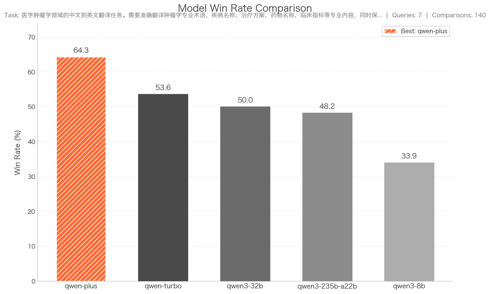

# Auto Arena

Automatically evaluate and compare multiple models or AI agents without pre-existing test data. This end-to-end pipeline generates test queries, collects responses, and ranks models/agents through pairwise comparison.


## Overview

Auto Arena is ideal for **model comparison**, **agent pipeline testing**, **new domain evaluation**, and **rapid prototyping**—all without preparing test data upfront.

!!! tip "No Test Data Required"
    Unlike traditional evaluation, Auto Arena generates its own test queries from the task description, eliminating the need for pre-existing test datasets.

The pipeline automates seven steps: generate test queries → collect responses → create evaluation rubrics → run pairwise comparisons → analyze results → generate report → create visualization.

| Step | Component | Description |
|------|-----------|-------------|
| 1 | `QueryGenerator` | Generate diverse test queries from task description |
| 2 | `ResponseCollector` | Collect responses from all target endpoints |
| 3 | `TaskBasedRubricGenerator` | Generate evaluation criteria for the task |
| 4 | `GradingRunner` | Run pairwise comparisons with judge model |
| 5 | `PairwiseAnalyzer` | Analyze results and produce rankings |
| 6 | `ReportGenerator` | Generate detailed Markdown evaluation report |
| 7 | `WinRateChartGenerator` | Create win rate visualization chart |


## Quick Start

Get started with Auto Arena in just a few lines of code. Choose the approach that best fits your workflow:

=== "Python API"

    The recommended way to run evaluations programmatically:

    ```python
    import asyncio
    from cookbooks.auto_arena.auto_arena_pipeline import AutoArenaPipeline

    async def main():
        pipeline = AutoArenaPipeline.from_config("config.yaml")
        result = await pipeline.evaluate()

        print(f"Best Model: {result.best_pipeline}")
        for rank, (model, win_rate) in enumerate(result.rankings, 1):
            print(f"{rank}. {model}: {win_rate:.1%}")

    asyncio.run(main())
    ```

=== "CLI"

    Run evaluations directly from the command line:

    ```bash
    # Run evaluation with config file
    python -m cookbooks.auto_arena --config config.yaml --save

    # Resume from checkpoint (default behavior)
    python -m cookbooks.auto_arena --config config.yaml --save

    # Start fresh, ignore checkpoint
    python -m cookbooks.auto_arena --config config.yaml --fresh --save

    # Use pre-generated queries
    python -m cookbooks.auto_arena --config config.yaml --queries_file queries.json --save
    ```

=== "Custom Queries"

    Skip query generation by providing your own queries file—useful when you want to evaluate models on a specific set of questions.

    Create a `queries.json` file with your test cases:

    ```json
    [
      {"query": "Translate: AI is transforming industries."},
      {"query": "Translate: The weather is nice today."},
      {"query": "Translate: How to learn programming effectively?"}
    ]
    ```

    !!! tip "Optional Fields"
        The `category` and `difficulty` fields are optional: `{"query": "...", "category": "general", "difficulty": "easy"}`

    Then run the evaluation with your queries:

    ```bash
    python -m cookbooks.auto_arena --config config.yaml --queries_file queries.json --save
    ```

All methods require a YAML configuration file. Here's a complete example:

```yaml
# Task description
task:
  description: "English to Chinese translation assistant"
  scenario: "Users need to translate English content into fluent Chinese"

# Target endpoints to evaluate
target_endpoints:
  gpt4_baseline:
    base_url: "https://api.openai.com/v1"
    api_key: "${OPENAI_API_KEY}"
    model: "gpt-4"
    extra_params:
      temperature: 0.7

  qwen_candidate:
    base_url: "https://dashscope.aliyuncs.com/compatible-mode/v1"
    api_key: "${DASHSCOPE_API_KEY}"
    model: "qwen-max"
    extra_params:
      temperature: 0.7

# Judge endpoint for pairwise evaluation
judge_endpoint:
  base_url: "https://dashscope.aliyuncs.com/compatible-mode/v1"
  api_key: "${DASHSCOPE_API_KEY}"
  model: "qwen-max"
  extra_params:
    temperature: 0.1

# Query generation settings
query_generation:
  num_queries: 20
  seed_queries:
    - "Translate this paragraph into Chinese: 'AI is transforming industries.'"
  queries_per_call: 10
  temperature: 0.9

# Evaluation settings
evaluation:
  max_concurrency: 10
  timeout: 60

# Output settings
output:
  output_dir: "./evaluation_results"
```

!!! note "Environment Variables"
    Use `${ENV_VAR}` syntax to reference environment variables for sensitive data like API keys.


## Component Guide

For fine-grained control, use individual pipeline components directly. The workflow below shows how each component connects:

<div class="workflow-single">
<div class="workflow-header">Pipeline Components</div>

<div class="workflow">
<ol class="workflow-steps">
<li><strong>Generate Test Queries</strong>

Use `QueryGenerator` to create diverse test queries from your task description. Supports parallel generation, automatic deduplication, and optional Evol-Instruct complexity evolution.</li>
<li><strong>Collect Responses</strong>

Use `ResponseCollector` to query all target models/agents concurrently and gather their responses for comparison.</li>
<li><strong>Generate Evaluation Rubrics</strong>

Use `TaskBasedRubricGenerator` to automatically create evaluation criteria (accuracy, completeness, clarity, etc.) tailored to your specific task.</li>
<li><strong>Run Pairwise Evaluation</strong>

Use `AutoArenaPipeline` to orchestrate the full evaluation, comparing all response pairs and producing final rankings.</li>
</ol>
</div>
</div>

??? example "Code Examples for Each Step"

    **Step 1: Generate Test Queries**

    ```python
    from cookbooks.auto_arena.query_generator import QueryGenerator
    from cookbooks.auto_arena.schema import TaskConfig, QueryGenerationConfig, OpenAIEndpoint

    task = TaskConfig(
        description="Code review assistant for Python",
        scenario="Review code for bugs, style issues, and improvements"
    )

    judge_endpoint = OpenAIEndpoint(
        base_url="https://api.openai.com/v1",
        api_key="your-api-key",
        model="gpt-4"
    )

    query_config = QueryGenerationConfig(
        num_queries=20,
        seed_queries=["Review this Python function for bugs..."],
        enable_evolution=True,
        evolution_rounds=1
    )

    generator = QueryGenerator(judge_endpoint, task, query_config)
    queries = await generator.generate()
    ```

    **Step 2: Collect Responses**

    ```python
    from cookbooks.auto_arena.response_collector import ResponseCollector
    from cookbooks.auto_arena.schema import EvaluationConfig

    collector = ResponseCollector(
        target_endpoints={"model_a": endpoint_a, "model_b": endpoint_b},
        evaluation_config=EvaluationConfig(max_concurrency=10)
    )
    responses = await collector.collect(queries)
    ```

    **Step 3: Generate Evaluation Rubrics**

    ```python
    from openjudge.generator.simple_rubric import TaskBasedRubricGenerator

    rubric_gen = TaskBasedRubricGenerator(
        model=judge_model,
        task_description=task.description,
        scenario=task.scenario,
    )
    rubrics = await rubric_gen.generate(sample_queries=[q.query for q in queries[:5]])
    # Output: Accuracy, Completeness, Clarity criteria
    ```

    **Step 4: Run Full Evaluation**

    ```python
    from cookbooks.auto_arena.auto_arena_pipeline import AutoArenaPipeline

    pipeline = AutoArenaPipeline(
        task_description="Code review assistant",
        target_endpoints=target_endpoints,
        judge_endpoint=judge_endpoint,
        num_queries=20
    )
    result = await pipeline.evaluate()
    ```


## Advanced Topics

=== "Understanding Results"

    The `EvaluationResult` provides comprehensive ranking statistics:

    | Field | Type | Description |
    |-------|------|-------------|
    | `rankings` | `List[Tuple[str, float]]` | Models sorted by win rate (best first) |
    | `win_rates` | `Dict[str, float]` | Win rate for each model (0.0-1.0) |
    | `win_matrix` | `Dict[str, Dict[str, float]]` | Head-to-head win rates between models |
    | `best_pipeline` | `str` | Model with highest win rate |
    | `total_queries` | `int` | Total number of test queries |
    | `total_comparisons` | `int` | Total number of pairwise comparisons |

    !!! example "Sample Output"
        ```
        ============================================================
        AUTO ARENA EVALUATION RESULTS
        ============================================================
        Task: English to Chinese translation assistant...
        Queries: 20 | Comparisons: 80

        Rankings:
          1. qwen_candidate      [################----] 80.0%
          2. gpt4_baseline       [########------------] 40.0%

        Best Pipeline: qwen_candidate
        ============================================================
        ```

    **Output Files:**

    | File | Description |
    |------|-------------|
    | `evaluation_report.md` | Detailed Markdown report with analysis |
    | `win_rate_chart.png` | Visual bar chart for presentations |
    | `comparison_details.json` | Traceable pairwise comparison records |
    | `evaluation_results.json` | Structured result data (JSON) |

=== "Query Generation Options"

    Fine-tune query generation behavior:

    | Option | Default | Description |
    |--------|---------|-------------|
    | `num_queries` | 20 | Total number of queries to generate |
    | `queries_per_call` | 10 | Queries per API call (1-50) |
    | `num_parallel_batches` | 3 | Number of parallel generation batches |
    | `temperature` | 0.9 | Sampling temperature for diversity |
    | `max_similarity` | 0.85 | Deduplication similarity threshold |
    | `enable_evolution` | false | Enable Evol-Instruct complexity evolution |
    | `evolution_rounds` | 1 | Number of evolution rounds (0-3) |

    ??? tip "Enable Evol-Instruct for Harder Queries"
        Evol-Instruct progressively increases query complexity:

        ```yaml
        query_generation:
          enable_evolution: true
          evolution_rounds: 2
          complexity_levels:
            - "constraints"    # Add time, scope, or condition constraints
            - "reasoning"      # Require multi-step reasoning
            - "edge_cases"     # Include edge cases
        ```

=== "Evaluation Report"

    Generate a comprehensive Markdown report with concrete examples:

    ```yaml
    report:
      enabled: true        # Enable report generation
      language: "zh"       # "zh" (Chinese) or "en" (English)
      include_examples: 3  # Examples per section (1-10)
    ```

    The report includes **Executive Summary**, **Ranking Explanation**, **Model Analysis**, and **Representative Cases**.

    All results are saved to the output directory:

    ```
    evaluation_results/
    ├── evaluation_report.md      # Generated Markdown report
    ├── win_rate_chart.png        # Win rate visualization chart
    ├── comparison_details.json   # All pairwise comparison details
    ├── evaluation_results.json   # Final rankings and statistics
    ├── queries.json              # Generated test queries
    ├── responses.json            # Model responses
    └── rubrics.json              # Evaluation criteria
    ```

    !!! tip "Example Report"
        View a real report: [Oncology Medical Translation Evaluation](sample_reports/oncology_translation_report.md)

=== "Win Rate Chart"

    Automatically generate a beautiful bar chart showing model win rates:

    ```yaml
    report:
      chart:
        enabled: true          # Enable chart generation (default: true)
        title: null            # Custom title (auto-generated if not set)
        figsize: [12, 7]       # Figure size (width, height) in inches
        dpi: 150               # Image resolution (72-300)
        format: "png"          # Output format: png / svg / pdf
        show_values: true      # Show percentage values on bars
        highlight_best: true   # Highlight best model with accent color
    ```

    **Chart Features:**

    - 🥇 **Best model highlighted** with orange diagonal stripes
    - 📊 **Gray gradient** for other models by rank
    - 🔢 **Value labels** on top of each bar
    - 🌏 **CJK font support** for Chinese/Japanese/Korean text

    

    *Example: Oncology medical translation evaluation with 5 models*

=== "Checkpoint & Resume"

    Evaluations automatically save checkpoints for resumption after interruptions:

    ```bash
    # First run (interrupted)
    python -m cookbooks.auto_arena --config config.yaml --save

    # Resume from checkpoint (automatic)
    python -m cookbooks.auto_arena --config config.yaml --save

    # Start fresh (ignore checkpoint)
    python -m cookbooks.auto_arena --config config.yaml --fresh --save
    ```

    Checkpoint stages: `QUERIES_GENERATED` → `RESPONSES_COLLECTED` → `RUBRICS_GENERATED` → `EVALUATION_COMPLETE`


## Best Practices

!!! tip "Do"
    - Start with a **clear task description** that captures the core objective
    - Use **seed queries** to guide query generation style
    - Set `num_queries` to at least **20** for statistically meaningful results
    - Choose a **strong judge model** (at least as capable as models being evaluated)
    - Use `--save` flag to persist results for later analysis
    - Use the generated **win rate chart** for presentations and reports

!!! warning "Don't"
    - Use a judge model weaker than the models being evaluated
    - Set `max_concurrency` too high for your API rate limits
    - Skip checkpoint resumption for long-running evaluations
    - Compare models with fundamentally different capabilities (e.g., text vs vision)

**Related Topics:** [Pairwise Evaluation](select_rank.md) · [Refine Data Quality](data_refinement.md) · [Create Custom Graders](../building_graders/create_custom_graders.md) · [Run Grading Tasks](../running_graders/run_tasks.md)

