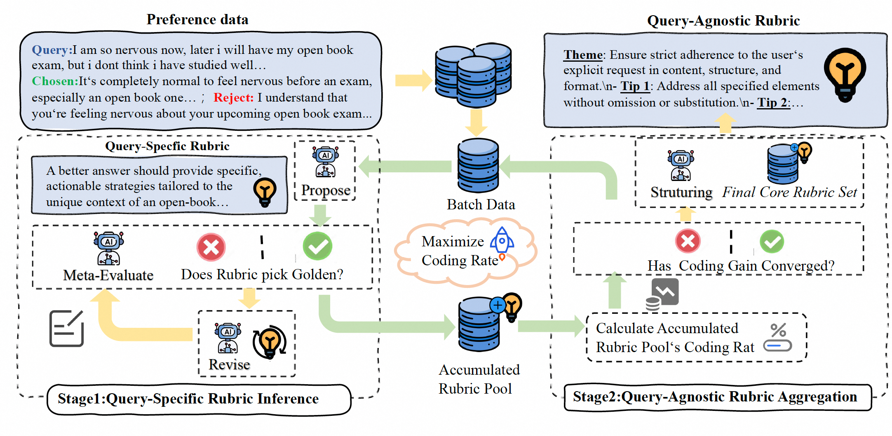

# Generate Rubrics as Graders

Automatically create evaluation graders instead of manually designing criteria. OpenJudge provides two approaches:

| Approach | Module | Data Required | Best For |
|----------|--------|---------------|----------|
| **Simple Rubric** | `simple_rubric` | Task description only | Quick prototyping, when you have no labeled data |
| **Iterative Rubric** | `iterative_rubric` | Labeled preference data | Production quality, when you have training examples |

!!! tip "Key Benefits"
    - **Save time** — Eliminate manual rubric design
    - **Intelligent** — Learn criteria from labeled data (Iterative) or task description (Simple)
    - **Consistent** — Produce reproducible evaluation standards
    - **Scalable** — Quickly prototype graders for new domains


## What is a Rubric?

A **rubric** is a set of evaluation criteria that guides the LLM judge on how to score responses. Instead of asking the LLM to "rate this response," you provide specific criteria like:

```
Theme: Accuracy
- Tip: The response should contain factually correct information
- Tip: Claims should be verifiable and not contradict established knowledge

Theme: Completeness
- Tip: The response should address all parts of the question
- Tip: Important details should not be omitted
```

**Why rubrics matter:**

- Without rubrics, LLM judges are inconsistent and subjective
- With rubrics, evaluations become reproducible and explainable
- The challenge: manually writing good rubrics is time-consuming and requires domain expertise

**The solution:** Automatically extract these criteria from your task description (Simple Rubric) or labeled data (Iterative Rubric).


## When to Use Each Approach

### Simple Rubric (Zero-Shot)

Use when you have a clear task description but **no labeled data**.

!!! tip "Use Simple Rubric When"
    - You need to quickly prototype a grader
    - You have no labeled preference or scored data
    - Your task is well-defined and you can describe it clearly
    - You want to get started immediately without data collection

!!! warning "Limitations"
    - Quality depends on task description clarity
    - May not capture domain-specific nuances
    - Less accurate than data-driven approaches

### Iterative Rubric (Data-Driven)

Use when you have **labeled preference data** and want production-quality graders.

!!! tip "Use Iterative Rubric When"
    - You have labeled evaluation data (preference pairs or scored responses)
    - Manual rubric design is too time-consuming or subjective
    - Your evaluation criteria are implicit and hard to articulate
    - You need high accuracy for production use

!!! warning "Don't Use When"
    - You have no labeled data (use Simple Rubric instead)
    - Your criteria are already well-defined and documented
    - Simple Code-Based evaluation is sufficient

## Simple Rubric: Zero-Shot Generation

Generate evaluation rubrics from task descriptions without any labeled data. The system uses an LLM to create relevant evaluation criteria based on your task context.

### How It Works

1. **Provide task description** — Describe what your system does
2. **Add context** — Optionally provide usage scenario and sample queries
3. **Generate rubrics** — LLM creates evaluation criteria automatically
4. **Create grader** — Rubrics are injected into an LLMGrader

### Quick Example

```python
import asyncio
from openjudge.generator.simple_rubric import (
    SimpleRubricsGenerator,
    SimpleRubricsGeneratorConfig
)
from openjudge.models import OpenAIChatModel
from openjudge.graders.schema import GraderMode

async def main():
    config = SimpleRubricsGeneratorConfig(
        grader_name="translation_quality_grader",
        model=OpenAIChatModel(model="qwen3-32b"),
        grader_mode=GraderMode.POINTWISE,
        task_description="English to Chinese translation assistant for technical documents. Generate rubrics in English.",
        scenario="Users need accurate, fluent translations of technical content. Please respond in English.",
        min_score=0,
        max_score=5,
    )

    generator = SimpleRubricsGenerator(config)
    grader = await generator.generate(
        dataset=[],
        sample_queries=[
            "Translate: 'Machine learning is a subset of AI.'",
            "Translate: 'The API endpoint returned an error.'",
        ]
    )

    return grader

grader = asyncio.run(main())
```

### Inspect Generated Rubrics

```python
print(grader.kwargs.get("rubrics"))
```

**Output (Example):**

```
1. Accuracy: Whether the translation correctly conveys the technical meaning of the original English text
2. Fluency: Whether the translated Chinese is grammatically correct and natural-sounding
3. Technical Appropriateness: Whether the terminology used in the translation is appropriate for a technical context
4. Consistency: Whether similar terms or phrases are consistently translated throughout the response
```

### Evaluate Responses

```python
result = await grader.aevaluate(
    query="Translate: 'The database query returned an error.'",
    response="数据库查询返回了一个错误。"
)
print(result)
```

**Output:**

```python
GraderScore(
    name='translation_quality_grader',
    reason="The translation is accurate and correctly conveys the technical meaning of the original English text. The Chinese sentence is grammatically correct and natural-sounding, making it fluent. The terminology used ('数据库查询' for 'database query', '返回了一个错误' for 'returned an error') is appropriate for a technical context. Additionally, the terms are consistently translated throughout the response.",
    score=5.0
)
```

### Simple Rubric Configuration

| Parameter | Type | Default | Description |
|-----------|------|---------|-------------|
| `grader_name` | `str` | required | Name for the generated grader |
| `model` | `BaseChatModel` | required | LLM for generation and evaluation |
| `grader_mode` | `GraderMode` | `POINTWISE` | `POINTWISE` or `LISTWISE` |
| `task_description` | `str` | `""` | Description of the task |
| `scenario` | `str` | `None` | Optional usage context |
| `language` | `LanguageEnum` | `EN` | Language for prompts (`EN` or `ZH`) |
| `min_score` | `int` | `0` | Minimum score (pointwise only) |
| `max_score` | `int` | `1` | Maximum score (pointwise only) |
| `default_rubrics` | `List[str]` | `[]` | Fallback rubrics if generation fails |
| `max_retries` | `int` | `3` | Retry attempts for LLM calls |

## Iterative Rubric: Data-Driven Generation

Learn evaluation rubrics from labeled preference data. Based on [Auto-Rubric: Learning to Extract Generalizable Criteria for Reward Modeling](https://arxiv.org/abs/2510.17314).

### How It Works

**Two-stage approach:**

1. **Infer query-specific rubrics** — For each labeled example, the system proposes criteria that explain why one response is better than another
2. **Generalize to core set** — Similar rubrics are merged and organized into a compact, non-redundant "Theme-Tips" structure

**Data efficiency:** Using just 70 preference pairs, this method enables smaller models to match or outperform fully-trained judge models.

<figure markdown="span">
  { width="100%" }
  <figcaption>Auto-Rubric Pipeline: From preference data to evaluation rubrics</figcaption>
</figure>

### Choose Your Evaluation Mode

| Mode | Config Class | Use Case | Data Format | Output |
|------|--------------|----------|-------------|--------|
| **Pointwise** | `IterativePointwiseRubricsGeneratorConfig` | Score individual responses (e.g., 1-5 rating) | `label_score` | `score`, `reason` |
| **Pairwise** | `IterativeListwiseRubricsGeneratorConfig` | Compare two responses (A vs B) | `label_rank` (2 items) | `ranking`, `reason` |
| **Listwise** | `IterativeListwiseRubricsGeneratorConfig` | Rank multiple responses (e.g., A > B > C) | `label_rank` | `ranking`, `reason` |

!!! note "Pairwise vs Listwise"
    Pairwise is a special case of Listwise with exactly 2 responses. Use the same `IterativeListwiseRubricsGeneratorConfig` for both.


### Complete Example: Build a Code Review Grader (Pointwise)

Let's walk through a complete example: building a grader that evaluates code explanation quality.

### Step 1: Prepare Labeled Data

```python
dataset = [
    {
        "query": "Explain what this Python code does: `[x**2 for x in range(10)]`",
        "response": "This is a list comprehension that creates a list of squares from 0 to 81. It iterates through numbers 0-9 and squares each one.",
        "label_score": 5  # Excellent: accurate, complete, clear
    },
    {
        "query": "Explain what this Python code does: `lambda x: x * 2`",
        "response": "It's a function.",
        "label_score": 2  # Poor: too brief, missing key details
    },
    {
        "query": "Explain what this Python code does: `dict.get(key, default)`",
        "response": "This method retrieves a value from a dictionary. If the key exists, it returns the associated value. If not, it returns the default value instead of raising a KeyError.",
        "label_score": 5  # Excellent: explains behavior and edge case
    },
    {
        "query": "Explain what this Python code does: `async def fetch(): ...`",
        "response": "This defines an asynchronous function named fetch.",
        "label_score": 3  # Okay: correct but lacks depth
    },
    # ... more examples (recommend 50-100)
]
```

### Step 2: Configure and Run the Generator

```python
import asyncio
from openjudge.generator.iterative_rubric.generator import (
    IterativeRubricsGenerator,
    IterativePointwiseRubricsGeneratorConfig
)
from openjudge.models import OpenAIChatModel

async def main():
    # Configure the generator
    config = IterativePointwiseRubricsGeneratorConfig(
        grader_name="code_explanation_grader",
        model=OpenAIChatModel(model="qwen3-32b"),
        min_score=1,
        max_score=5,
        query_specific_generate_number=2,
        enable_categorization=True,
        categories_number=3,
        # Optional: provide task context to guide rubric generation
        task_description="Evaluate the quality of Python code explanations, focusing on accuracy, completeness, and clarity."
    )

    # Generate the grader
    generator = IterativeRubricsGenerator(config)
    grader = await generator.generate(dataset)

    return grader

grader = asyncio.run(main())
```

### Step 3: Inspect the Generated Rubrics

After generation, you can inspect the learned rubrics (stored in `grader.kwargs`):

```python
print(grader.kwargs.get("rubrics"))
```

**Output (Generated Rubrics):**

```
Rubric 1:
Theme: Correct Identification and Explanation of Code Type and Purpose
- Tip1: Accurately identifies the type of Python code (e.g., list comprehension, lambda function, asynchronous function) and explains its purpose.
- Tip2: Provides a basic explanation of what the code does, such as generating a list of squared numbers or doubling an input.

Rubric 2:
Theme: Detailed Functional Understanding and Contextual Clarity
- Tip1: Describes the range of values processed by the code and the resulting output values.
- Tip2: Includes additional context or examples that clarify how the code operates in practice, such as explaining `dict.get()` behavior or providing usage examples for lambda functions.

Rubric 3:
Theme: Depth of Explanation for Advanced Concepts
- Tip1: Explains advanced features like asynchronous execution using `async def`, non-blocking behavior, and typical use cases (e.g., with `await` or event loops).
- Tip2: Clearly differentiates between correct and incomplete explanations, assigning higher scores for depth and accuracy.
```

These rubrics are automatically injected into the evaluation prompt when the grader runs.

### Step 4: Evaluate New Responses

Now use the grader to evaluate new code explanations:

```python
async def evaluate_new_response():
    result = await grader.aevaluate(
        query="Explain what this Python code does: `map(str, [1, 2, 3])`",
        response="The map function applies str to each element in the list, converting integers to strings. The result is a map object that yields '1', '2', '3' when iterated."
    )
    print(result)

asyncio.run(evaluate_new_response())
```

**Output:**

```python
GraderScore(
    name='code_explanation_grader',
    score=4.0,
    reason="The response correctly identifies the code as using the `map` function and accurately explains its purpose of converting integers to strings. It also describes the resulting output as a map object that yields string values when iterated, which demonstrates functional understanding. However, it lacks additional context or examples (e.g., how to convert the map object into a list for immediate use) that could further clarify how the code operates in practice, slightly limiting its depth."
)
```

### Step 5: Compare Good vs. Bad Responses

```python
# Evaluate a poor response
result = await grader.aevaluate(
    query="Explain what this Python code does: `map(str, [1, 2, 3])`",
    response="It maps things."
)
print(result)
```

**Output:**

```python
GraderScore(
    name='code_explanation_grader',
    score=1.0,
    reason="The response 'It maps things.' is extremely vague and lacks any meaningful explanation of what the code does. It fails to identify the type of Python code (e.g., the use of the `map` function), explain its purpose, describe the transformation applied, or provide any contextual clarity. The explanation is insufficient and does not meet even the most basic criteria for understanding or explaining the code."
)
```

### Complete Example: Build a Code Solution Comparator (Pairwise)

Let's build a grader that compares two code implementations and determines which solution is better. This is useful for code review, interview assessment, or selecting the best implementation from multiple candidates.

### Step 1: Prepare Pairwise Data

```python
dataset = [
    {
        "query": "Write a function to check if a string is a palindrome.",
        "responses": [
            """def is_palindrome(s):
    s = s.lower().replace(" ", "")
    return s == s[::-1]""",
            """def is_palindrome(s):
    for i in range(len(s)):
        if s[i] != s[len(s)-1-i]:
            return False
    return True"""
        ],
        "label_rank": [1, 2]  # Solution 1 is better: concise, handles case/spaces
    },
    {
        "query": "Implement a function to find the maximum element in a list.",
        "responses": [
            """def find_max(lst):
    if not lst:
        return None
    return max(lst)""",
            """def find_max(lst):
    m = lst[0]
    for x in lst:
        if x > m:
            m = x
    return m"""
        ],
        "label_rank": [1, 2]  # Solution 1 is better: handles edge case, uses built-in
    },
    {
        "query": "Write a function to merge two sorted lists into one sorted list.",
        "responses": [
            """def merge(a, b):
    return sorted(a + b)""",
            """def merge(a, b):
    result = []
    i = j = 0
    while i < len(a) and j < len(b):
        if a[i] <= b[j]:
            result.append(a[i])
            i += 1
        else:
            result.append(b[j])
            j += 1
    result.extend(a[i:])
    result.extend(b[j:])
    return result"""
        ],
        "label_rank": [2, 1]  # Solution 2 is better: O(n) vs O(n log n), proper merge algorithm
    },
    {
        "query": "Implement a function to count word frequency in a text.",
        "responses": [
            """def word_freq(text):
    words = text.lower().split()
    freq = {}
    for w in words:
        freq[w] = freq.get(w, 0) + 1
    return freq""",
            """from collections import Counter
def word_freq(text):
    return Counter(text.lower().split())"""
        ],
        "label_rank": [2, 1]  # Solution 2 is better: idiomatic, uses standard library
    },
    # ... more examples (recommend 50-100)
]
```

!!! tip "Label Format"
    - `label_rank` contains the rank for each solution (smaller = better)
    - `[1, 2]` means the first solution is better than the second
    - `[2, 1]` means the second solution is better than the first

### Step 2: Configure and Run the Generator

```python
import asyncio
from openjudge.generator.iterative_rubric.generator import (
    IterativeRubricsGenerator,
    IterativeListwiseRubricsGeneratorConfig  # Use Listwise config for pairwise
)
from openjudge.models import OpenAIChatModel

async def main():
    # Configure the generator (Pairwise uses Listwise config)
    config = IterativeListwiseRubricsGeneratorConfig(
        grader_name="code_solution_comparator",
        model=OpenAIChatModel(model="qwen3-32b"),
        query_specific_generate_number=2,
        enable_categorization=True,
        categories_number=3,
        # Optional: provide task context to guide rubric generation
        task_description="Compare code solutions based on correctness, efficiency, and code quality."
    )

    # Generate the grader
    generator = IterativeRubricsGenerator(config)
    grader = await generator.generate(dataset)

    return grader

grader = asyncio.run(main())
```

### Step 3: Inspect the Generated Rubrics

```python
print(grader.kwargs.get("rubrics"))
```

**Output (Generated Rubrics):**

```
Rubric 1:
Theme: Correctness and Edge Case Handling
- Tip1: The solution must produce correct output for all valid inputs, including edge cases such as empty lists or lists of unequal lengths.
- Tip2: Proper handling of special characters, case insensitivity, and whitespace should be integrated seamlessly without requiring manual preprocessing.

Rubric 2:
Theme: Algorithmic Efficiency and Optimality
- Tip1: Preference is given to solutions with optimal time complexity (e.g., O(n + m) for merging sorted lists rather than O((n + m) log(n + m)) via sorting).
- Tip2: Efficient use of built-in functions or idiomatic Python constructs contributes to better performance and clarity.

Rubric 3:
Theme: Code Readability and Conciseness
- Tip1: Solutions should be concise, using minimal lines of code while maintaining clarity and avoiding unnecessary complexity.
- Tip2: Use of standard library features (e.g., collections.Counter) demonstrates good coding practices and familiarity with Python's ecosystem.
```

### Step 4: Compare New Code Solutions

```python
async def compare_solutions():
    result = await grader.aevaluate(
        query="Write a function to remove duplicates from a list while preserving order.",
        responses=[
            """def remove_duplicates(lst):
    seen = set()
    result = []
    for x in lst:
        if x not in seen:
            seen.add(x)
            result.append(x)
    return result""",
            """def remove_duplicates(lst):
    return list(set(lst))"""
        ]
    )
    print(result)

asyncio.run(compare_solutions())
```

**Output:**

```python
GraderRank(
    name='code_solution_comparator',
    rank=[1, 2],
    reason="Response 1 is the best because it correctly removes duplicates while preserving the order of elements. It uses a set for O(1) lookups and a list to maintain insertion order, which ensures correctness and optimal time complexity (O(n)). It also handles edge cases like empty lists gracefully. Response 2 is worse because converting a list to a set and back to a list does not preserve order, violating the problem's requirement. While it is concise and efficient in terms of code length, it fails on correctness for ordered preservation, making it inferior."
)
```


## Iterative Rubric Configuration Reference

### Core Parameters

| Parameter | Type | Default | Description |
|-----------|------|---------|-------------|
| `grader_name` | `str` | required | Name for the generated grader |
| `model` | `BaseChatModel` | required | LLM to use for generation and evaluation |
| `language` | `LanguageEnum` | `EN` | Language for prompts (`EN` or `ZH`) |
| `enable_categorization` | `bool` | `False` | Group similar rubrics into categories |
| `categories_number` | `int` | `5` | Target number of categories |
| `query_specific_generate_number` | `int` | `1` | Rubrics to generate per training sample |
| `task_description` | `str` | `None` | Optional task context to guide rubric generation |

### Pointwise-Specific Parameters

| Parameter | Type | Default | Description |
|-----------|------|---------|-------------|
| `min_score` | `int` | `0` | Minimum score value |
| `max_score` | `int` | `1` | Maximum score value |

### Evaluation Prompt

| Parameter | Type | Default | Description |
|-----------|------|---------|-------------|
| `custom_evaluation_prompt` | `PromptTemplate` | `None` | Custom evaluation prompt template (auto-selected if not provided) |

!!! tip "Default Templates"
    The system automatically selects the appropriate template based on `grader_mode`:

    - **Pointwise mode** → `POINTWISE_EVALUATION_TEMPLATE`
    - **Listwise mode** → `LISTWISE_EVALUATION_TEMPLATE`

    You only need to set `custom_evaluation_prompt` if you want to override the default behavior.


---

## Choosing Between Simple and Iterative Rubric

| Scenario | Recommended Approach |
|----------|---------------------|
| Quick prototype, no data | **Simple Rubric** |
| Production grader with labeled data | **Iterative Rubric** |
| Well-defined task, need fast setup | **Simple Rubric** |
| Complex domain, implicit criteria | **Iterative Rubric** |
| < 50 labeled examples | **Simple Rubric** (or collect more data) |
| 50-100+ labeled examples | **Iterative Rubric** |

!!! tip "Workflow Recommendation"
    1. Start with **Simple Rubric** for quick prototyping
    2. Collect preference data during initial deployment
    3. Upgrade to **Iterative Rubric** when you have 50+ labeled examples

---

## Tips

### Data Quality (Iterative Rubric)

!!! tip "Good Practices"
    - Clear preference signals (good vs. bad is obvious)
    - Diverse query types covering your use case
    - Consistent labeling standards

!!! warning "Avoid"
    - Ambiguous cases where labels are debatable
    - Noisy or contradictory labels

### Task Description Quality (Simple Rubric)

!!! tip "Good Practices"
    - Be specific about what your system does
    - Include the target audience or use case
    - Mention key quality dimensions you care about
    - Provide representative sample queries

!!! warning "Avoid"
    - Vague descriptions like "chatbot" or "assistant"
    - Missing context about the domain
    - No sample queries (the LLM needs examples)

### Parameter Tuning (Iterative Rubric)

| Goal | Recommended Settings |
|------|---------------------|
| Fast prototyping | `query_specific_generate_number=1`, `enable_categorization=False` |
| Small dataset (50-100) | `query_specific_generate_number=1`, `enable_categorization=False` |
| Medium dataset (≤100) | `query_specific_generate_number=2-3`, `enable_categorization=True`, `categories_number=5` |
| Large dataset (>100) | `query_specific_generate_number=1`, `enable_categorization=True`, `categories_number=5`|


## Next Steps

- [Run Grading Tasks](../running_graders/run_tasks.md) — Execute your generated graders at scale
- [Grader Analysis](../running_graders/grader_analysis.md) — Analyze and validate grader results
- [Create Custom Graders](create_custom_graders.md) — Build graders manually with custom logic
